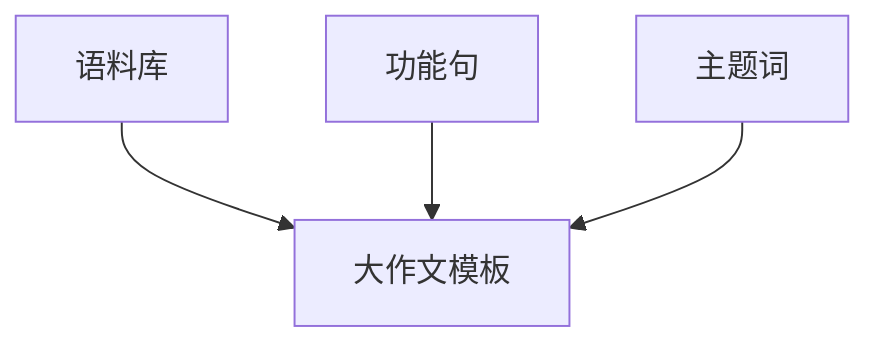

---
tags:
  - 英语/考研英语/考研英语写作
---

> **适用说明：** 本模板基于 Vita W 的逻辑公式优化，严格对标考研英语大纲，适用于英语一（图画/图画/材料）及英语二（图表/图画）

---
## 核心逻辑公式 (The Logic Formula)

$$
\text{Argumentation} = \text{WHY} = \text{WHEN} + \text{WHO} + \text{HOW} + \text{WHAT}
$$

* **WHEN**: 时代背景 (In such a ... era)
* **WHO**: 具体身份 (Freshmen/Jobseekers/Netizens...)
* **HOW**: 具体行为 (Manifests itself in...)
* **WHAT**: 具体结果 (Directly leads to...)

---

## ¶ 第一段：现象描述 (Description)

### 【类型 A：图画作文 (英语一核心)】

**As is vividly depicted in the picture,** [地点状语, e.g., in front of the goal] stands/sits **[核心人物]**, who is **[伴随动作 (v-ing), e.g., trembling with fear]**. The drawing presents a meaningful contrast: **[描述画面对比细节]**. 
**Most strikingly,** the character complains/insists that "**[引用或改写图中文字]**".
Conspicuously, the picture aims to convey that [主题词：eg:[perseverance/determination/innovation] is **of paramount importance** in our lives and warrants **utmost priority**.

### 【类型 B：图表作文 (英语二核心)】

 
**As the [bar/line/pie] chart show,** meaningful changes have taken place in **[图表标题]**. Specifically, the [number/percentage] of **[对象 1]** soared from the **nadir** of [最低值] in [年份] to the **zenith** of [最高值] in [年份]. 

**In stark contrast / Simultaneously,** **[对象 2]** demonstrated a [similar/opposite] trend, which [climbed/slid] from [数值] to [数值]. **Obviously, it takes on an overtone that** **[一句话总结趋势, e.g., ever-growing people tend to focus on...]**.

### 【类型 C：材料/新题型】

**When it comes to [主题词], public opinions may vary.** Every once in a while, the **pendulum** of views on this issue can be seen to swing from one side to the other. 

**This excerpt reveals that** **[总结材料观点]**, on the grounds that **[改写材料中的原因]**. **From my perspective, I** [concur with/am neutral about] **such a standpoint**.

---
### 【类型 D：图画+图表作文 (混合型)】

**As is vividly depicted in the picture,** [地点状语, e.g., in front of the screen] stands/sits **[核心人物]**, who is **[伴随动作 (v-ing), e.g., indulging in online games]**. This visual image highlights the **[图画主题词, e.g., prevalence of internet addiction]**.

**Coincidentally, it aligns with the chart that** **[一句话概括图表描述的对象, e.g., shows the time spent online]**1. Specifically, the [number/percentage] of **[图表主要对象]** soared from the **nadir** of [最低值] in [年份] to the **zenith** of [最高值] in [年份]2.

**Obviously, the combined message is to emphasize that [一句话总结图画和图表共同揭示的主题]**.

---
## ¶ 第二段：核心论证 (Argumentation)

### 1. 总起句 (Topic Sentence)

In my opinion, **[主题词]** serves as a strong **shot in the arm** for [beneficiary] / is a **double-edged sword**.

### 2. 论点一：正面/主要原因 (具体化论证)

> **公式应用：** $$\text{WHEN} \rightarrow \text{WHO} \rightarrow \text{HOW} \rightarrow \text{WHAT}$$

**On the plus side / Most importantly, along with the advent and penetration of** **[WHEN: 具体时代]**, it could has a paramount potential to be a big boon for **[WHO: 具体身份]**.

**And so it goes,** their engagement with **[主题词]** manifests itself in **[HOW: 具体行为 (doing sth.)]**.

**This series of actions thereby directly leads to** **[WHAT: 具体结果]**.

### 3. 论点二：反面/深层原因 (视角转换)

**On the flip side / Furthermore,** [引入论点 2]. **In such a highly** **[WHEN: ...-ized]** **era**, **[WHO: 另一主体, e.g., developers]** often **[HOW: 具体做法]**.

*(高分句式: 无灵主语)*: **The [accessibility/popularity] of [主题词] enables/renders [WHO] to [WHAT].**

**Over the long haul,** a [virtuous/vicious] circle has been completed.

---

## ¶ 第三段：总结与建议 (Conclusion)

**In a nutshell,** the spirit/issue of **[主题词]** grasps the master key to [personal growth/social development] and should be held in high regard.

**Given the complexity of this issue, it is imperative that concerted efforts be made.**

* For the **authorities/media**, they are supposed to **[publicize the merits / issue regulations]** in a comprehensive manner.
* For **individuals**, we are obliged to **[exercise self-discipline / foster a rational mindset]**.

**Only in this way can we** ensure a promising future.

---

> [!TIP]+ 关联链接
>本模板中的语料内容：[[英语作文语料库|语料库]]
>主题词结合记忆：[[考研英语写作主题词一页纸]]
>重要功能句汇总：[[英语大作文功能句]]

